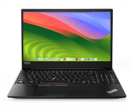

# Hackintosh for Lenovo ThinkPad E580



OpenCore configuration for my main laptop. Currently runs macOS Sonoma (14.6) but planning to upgrade it to macOS Sequoia once it's stable and AirportItlwm works on it.

I strongly recommend you to use rEFInd when you want to dual boot. Booting Windows through Bootcamp has been only problematic.

If you're planning to use this, I recommend you check the Dortania OpenCore guide first to fix things like language, iServices and keyboard layout.

> [!WARNING]
> This Hackintosh build is very personalized. It has NVMe disabled completely for example (Samsung PM981 issues) using kernel arguments and I use SATA, so please change the settings before updating.
> You should have some experience with Hackintosh and not use this blindly!

OpenCore version: 1.0.0

## Specs
- CPU: Intel Core i5-8250U (8 cores, 16 threads)
- GPU: Intel UHD Graphics 620 (dGPU is not supported, see later)
- RAM: 8GB DDR4
- Storage: I use a SATA SSD and leave my NVMe for Windows, but it should work on both. (except Samsung PM981)
- Ethernet: RTL8111/8168/8411
- Wi-Fi: Intel 3165AC+BT (supported by itlwm)

## What works
- HDMI video out + audio out
- USB ports (including USB-C)
- 3.5mm audio jack (haven't tried microphone yet)
- Keyboard
- Webcam
- Integrated speakers and microphone
- Ethernet
- Trackpad
- Function keys
- Wi-Fi and Bluetooth
- Function keys (see below)

## What doesn't work
- dGPU if you have one
- AirDrop and related services because of limited Intel wireless card support, can be fixed by replacing.
- Touch ID
- SD card reader

## Known issues
- HDMI doesn't work when booting up while HDMI is plugged in (must be plugged in after it finished booting)
- Function keys stop working after waking from sleep
- On Sonoma, Bluetooth is not 100% reliable.

## Disable hibernation
You might want to disable hibernation after installing, and here's how:
```bash
sudo pmset -a hibernatemode 0
sudo rm /var/vm/sleepimage
sudo mkdir /var/vm/sleepimage
sudo pmset -a standby 0
sudo pmset -a autopoweroff 0
```

## Function keys
To make the function keys work, you need to install [ThinkPad Assistant](https://github.com/MSzturc/ThinkpadAssistant/releases/download/v1.9.2.1/ThinkpadAssistant.dmg)

## How to use
You need:

1. a USB stick with atleast 16GB of storage
2. Lenovo ThinkPad E580
3. a Mac/another Hackintosh to make the installer

For some reason you cannot download Sonoma from macrecovery yet, so this is your only option.

Step 1: Get macOS onto your USB stick. You can do this [using another macOS system](https://dortania.github.io/OpenCore-Install-Guide/installer-guide/mac-install.html). You cannot get that result on Windows or Linux yet, unless you use a macOS VM, which I won't get into.

Step 2: Use [MountEFI](https://github.com/corpnewt/MountEFI) to mount your bootable USB's EFI partition, and copy the EFI folder to it.

Step 3: Plug the USB into the laptop and when you see the Lenovo logo press Enter to interrupt normal boot. Open UEFI setup and make sure Secure Boot and Fast Boot is disabled. Leave after.

Step 4: Press F12 during the Lenovo logo and select your USB stick.

Step 5: Go through the installer and follow the instructions.

Step 6: Once the installer is done, you still need to move the USB's EFI folder to your SSD's EFI partition. Use OpenCore Configurator for that.

And that's it! Make sure to install ThinkPad Assistant to fix the function keys.

## Updating
If this repo gets updated to support a new major macOS version, you need to move the EFI folder to a USB stick temporarily. Then you should be able to update your macOS, but make sure to boot from the USB once it reboots to apply the new EFI folder. Once you confirmed it works, you can move the new EFI folder to your SSD's EFI partition.
